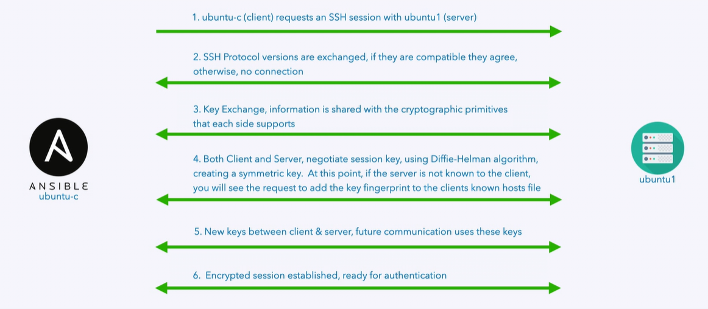
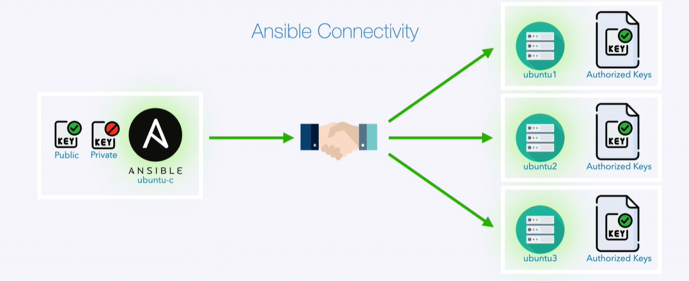

**1. Installing docker:**

- Windows:
    - check virtualization is enabled or not in task bar.
    - open web browser and type docker desktop
    - download stable version for windows.

- Linux: (ops-server)
    - install docker and docker compose.

**2. Installing Ansible Lab**

- clone https://github.com/spurin/diveintoansible-lab in home/vidya/ directory
- change the path in .env file
- run `docker-compose up`
- in browser, http://161.85.18.78:1000/ (ops-server 1000 port)
- go to ansible terminal - click ubuntu-c - after clicking change localhost to ip of ops-server - use login:ansible and password:password.
- Follow README.mde=sa
**3. Configuring SSH connectivity between hosts**

- 

- 

- create keys on ubuntu-c using `ssh-keygen`
- copy the content of public-key to authorized_keys file on remote system
    - if we are doing it manually, check the permissions of authorized_keys file and .ssh directory.
    - the efficient way to use ssh-copy-id tool `ssh-copy-id ansible@ubuntu1` i.e. `ssh-copy-id username@remotesystem`
- now we want to copy the public key from our ansible host (ubuntu-c) to all our target systems (ubuntu1, ubuntu2, ubuntu3, cebtos1, centos2, centos3) as both ansible and root user.
    - we can manually run `ssh-copy-id username@remotesystem` command and provide password of each target.
    - or we can automate it as follows:
    

